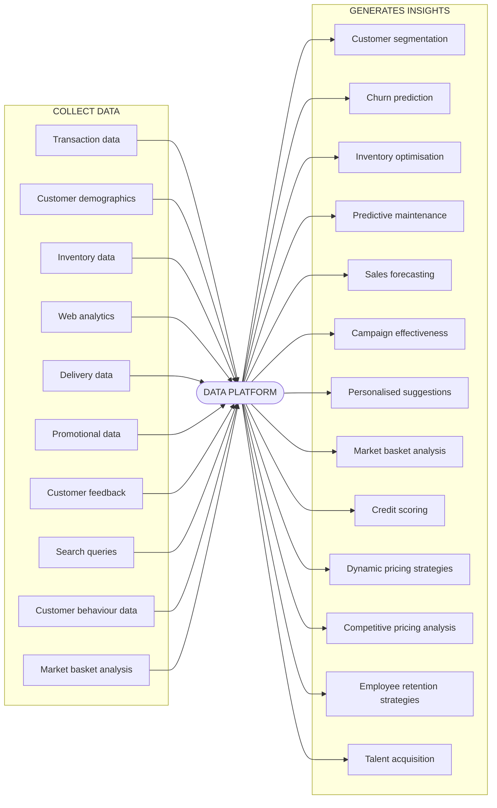

Tags: #node 
# 1. Computable Problems
In A Level Computer Science, computational methods refer to a set of problem-solving techniques that use algorithms and mathematical models to analyse, simulate, and solve complex problems efficiently using a computer.
## Key Features:
- **Finite solutions**: Solvable within realistic Problem recognition is determining if there is a problem that needs to be solvedtime/resource limits
- **Clear I/O**: Defined inputs → transformations → outputs
- **Algorithmic**: Can be expressed as step-by-step procedures
## Constraints:
- Processing power
- Memory limitations
- Time complexity (e.g., NP-hard problems)
# 2. Problem Recognition
Problem recognition is determining if there is a problem that needs to be solved
## Process:
1. **Stakeholder analysis**: Identify user needs
2. **Current system evaluation**:
   - SWOT analysis (Strengths/Weaknesses)
   - Data requirements (volume/type)
1. **Requirement specification**:
   Example: "System must process 10,000 transactions/hour"
# 3. Problem Decomposition
Breaking down a big problem into smaller problems so that they can be solved independently
## Benefits:
- Parallel development
- Easier debugging
- Code reusability
## Example: E-commerce System
![[deepseek_mermaid_20250724_4002c9.svg]]
# 4. Divide and Conquer
a strategy to make a complex task easier by breaking it into smaller, more manageable tasks
## Algorithmic Approach:
1. **Divide**: Break into subproblems (e.g., binary search halves dataset)
2. **Conquer**: Solve subproblems recursively
3. **Combine**: Merge solutions
# 5. Abstraction Techniques
the removal of unnecessary components of a problem to allow focus on only those that are necessary
## Use of Abstraction - Computer Games
- Computer games use a large amount of abstraction, removing the elements that a user does not need to consider in order to enjoy playing the game
- When using abstraction in computer games which are designed to simulate real life, the aim is to make the game realistic and visually appealing whilst keeping the game fun to play
- In a game that simulates a sport, it is important to the user that visually they recognise the environment and when they perform an action, they see a response
- However, users do not need to know the complex algorithms used to control the non player characters (NPCs)
# 6. Problem-Solving Strategies
## Backtracking
a technique that is used when you don’t have enough information to find a solution to a problem or if you have many possible ways of solving a problem
- **Mechanism**: search by exploring each solution with state rollback
- **Applications**:
    - Sudoku solvers
    - N-queens problem
## Data Mining
In A Level Computer Science, data mining is when large quantities of data are turned into useful information so that patterns can be found

**Example Finance and banking**:
- Machine learning models trained on historical data can be used to identify suspicious activities among millions of transactions
- Credit card companies use data mining algorithms to flag potentially fraudulent transactions in real-time
## Heuristics
In A Level Computer Science, heuristics is making use of experience to find a solution to a problem quickly. It uses concepts like 'rules of thumb' and 'educated guesses' to find a solution faster than traditional methods
- It prioritises speed and **not** accuracy
- It aims to find a solution that is 'good enough' rather than perfect
- The A* algorithm is a common example that uses heuristics in pathfinding and graph traversal    
- The aim of the A* algorithm is to use heuristics to find a path from a start node to an end node quickly, however, the path that it finds may not always be the most efficient path possible
## Performance Modelling
- In A Level Computer Science, performance modelling is when the behaviour of something is tested or simulated before it is used in the real world. It is a systematic approach that can be used for evaluating and predicting the performance characteristics of a software system
**Examples**:
- Database optimisation
	- Performance modelling can be used to simulate different database architectures and query strategies to find the most efficient setup
	- It can help select the best indexing strategy and estimate the query response times under varying loads
	- It may help decide between a relational database design or a single table design
- Caching mechanisms
	- By modelling how different caching strategies perform under various scenarios, optimal cache sizes can be determined 
	- Developers can assess the hit/miss ratio of caches and the latency improvements gained through caching
## Pipelining
the process of carrying out multiple instructions concurrently. It improves the overall efficiency and performance of a task or instruction

`grep “hello” docs | grep “world”`

- Here two `grep` commands (search) are chained together to perform a specific task
- The first `grep` command `grep “hello” docs` searches for lines that contain the word “hello” in a list of files contained in a file named ‘docs’
- The pipe symbol ‘**|**’ connects the **output of the first command** to the **input of the second command** meaning only lines containing the word “hello” are passed to the second command
- The second `grep` command `grep “world”` searches for lines in the **filtered results** from command 1 that contain the word “world”
## Visualization
when data or concepts are presented in simpler form for humans to understand. It will often create a graphical or visual representation of something to understand complex systems or data.
**Examples**:
- Flowcharts
- Unified Modeling Language Diagrams
- Wireframes